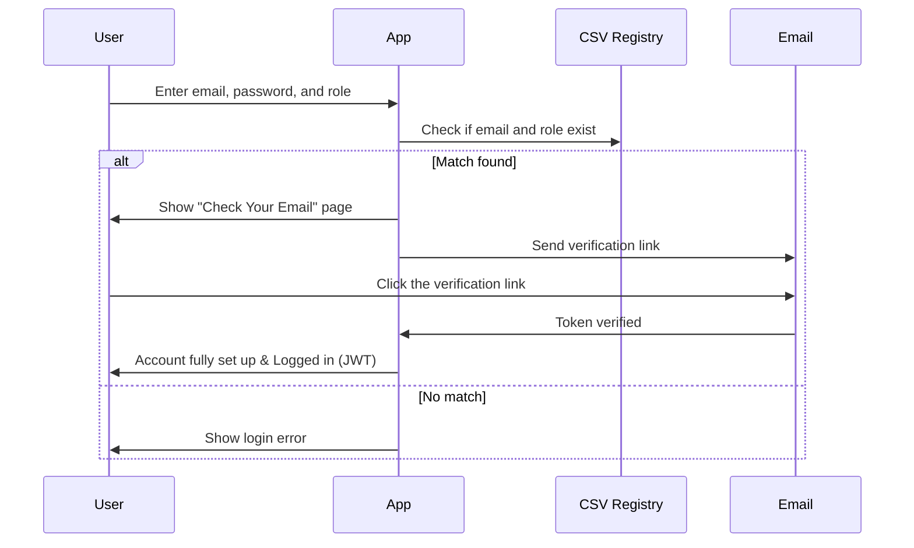
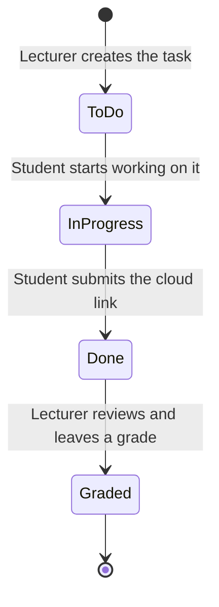

# Collaborative Academic Task Manager

Hey! Welcome to our **Collaborative Academic Task Manager**. We built this project to help students and lecturers keep track of class assignments and unit work without getting confused. 

## How to Log In

We built the authentication system using Django and JWT (JSON Web Tokens). 

Here is exactly how it works when a new user tries to log in:
1. The app checks your email against a CSV registry (`university_db.csv`) to make sure you are a real student or staff member.
2. It also checks that your role matches what we have on file.
3. If everything is correct, the app puts your account in a pending state and sends you to a "Check Your Email" page.
4. You get an email with a verification link. 
5. Once you click the link in your email, your real account is created, and you are officially logged in with a JWT!

### Login/Registration Flow

## The Dashboards

There are two main dashboards depending on your account role.

### Student Dashboard
* **My Tasks**: Shows you a list of all your assignments. You can see the due dates and whether the priority is High, Medium, or Low.
* **Submit Work**: To submit an assignment, you just copy and paste a cloud link (like a Google Docs link or a GitHub repo link) into the system.

### Staff Dashboard
* **Creating Tasks**: Lecturers can create an assignment for a specific unit, give it a due date, and decide if late submissions are allowed.
* **Reviewing Work**: Staff can view the cloud links that students submit and leave a grade along with some text feedback.
* **Kanban Board**: Lecturers and students can look at tasks as cards on a board and track their progress over time.

### Task Progress Flow

## How to Use (For First-Time Students)

If you are a student logging in for the very first time, here is what you do:

1. Open the app and enter your university email and a password. Make sure to select the "student" role.
2. If your email is listed in the university records, you'll be asked to check your email.
3. Go to your email inbox, find the message from the app, and click the verification link.
4. You will be logged in! Go to your **Student Dashboard** and look at **My Tasks** to see your assignments.
5. When you start an assignment, change its status to "In Progress".
6. When you are totally finished, paste the link to your work into the submission box and put the task in the "Done" pile.
7. Check back later to see the grade and feedback your lecturer gave you.

## Coding Setup

We kept the tech stack straightforward for this project:
* **Frontend**: We built the user interface with React.
* **Backend**: We used Django (Python) to handle the database and API logic.
* **Database**: We are using a MySQL database hosted on the cloud to store all the users and tasks.

## Deployment

The app is already live, so you don't even need to mess with servers on your computer to view it.
* The frontend is hosted on **GitHub Pages**.
* The Django backend is running on **Render**.
